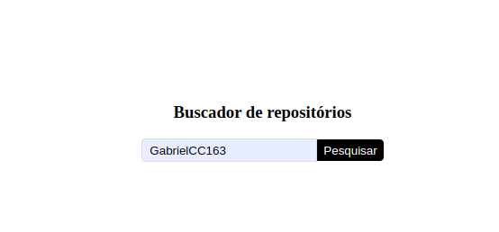
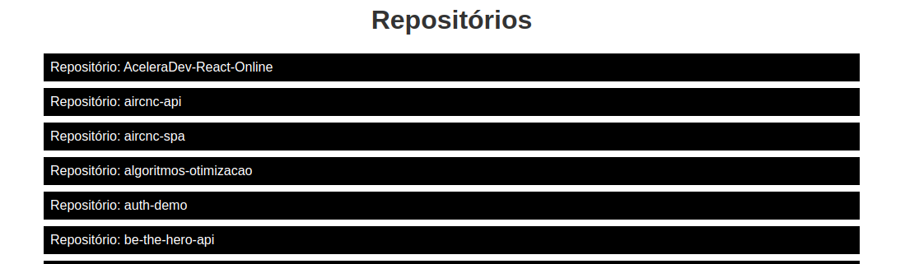

# Buscador de repositórios - React SPA

## Dependências
```
axios, react-router-dom, styled-components
```

## Conceitos:
```
Componentização,
estado,
propriedades,
rotas,
hooks (useEffect, history, useState),
renderização condicional
requisições com axios
```



